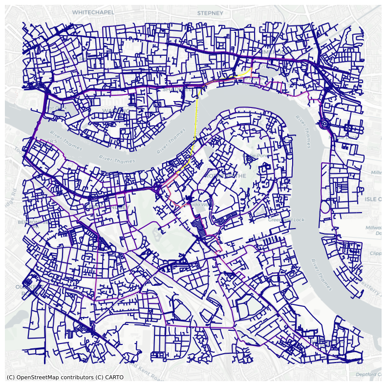

## GEOG0051 Mining Social and Geographic Datasets

### FORMATIVE ASSESSMENT
Name: Joel Goh <br>
Date: 9 February 2024


### 1. Introduction

This analysis explores the relationship between the locations of cafes 2000m around Canada Water station and several measures of street network centrality.

The research question is "which has a greater influence on the location of cafes around Canada Water Station - closeness centrality or betweenness centrality?"

### 2. Description of neighbourhood and dataset.

Canada Water Station is on the Jubilee line. It is south of the River Thames, within Southwark Borough and is part of the Docklands area in southeast London. The area surrounding the station was redeveloped, beginning in the 1980s and is still ongoing, with continued gentrification. It is a mixed-use area with retail and leisure (including a shopping mall), residential, and public amenities such as a library, schools, and a community centre. The neighbourhood has access to green (parks) and blue (canals, lake, river) spaces.

From OpenStreetMaps data, there are 94 cafes (amenities tagged as "cafe") within 2000m from Canada Water station and several stations including Bermondsey, Tower Hill, Aldgate, Aldgate East, Limehouse, and Canary Wharf.

Figure 1 shows the location of cafes and station entrances 2000m around Canada Water Station.


Figure 1: Location of cafes and station entrances around Canada Water Station


### 3. Analysis
From Figure 1, generally clusters of cafes are observed surrounding underground stations. Closeness and betweenness centrality was calculated for the road network. Figures 2 and 3 visualise closeness centrality and betweenness centrality respectively. Streets in warmer colours indicate higher centrality while cooler colours indicate lower centrality.


Figure 2: Closeness centrality for road network (walking) around Canada Water Station


Figure 3: Betweenness centrality for road network (walking) around Canada Water Station


### 4. Discussion

From Figure 2, roads with the highest closeness centrality are north and west of Canada Water Station including the areas surrounding the A200 Road, Jamaica Road, Rotherhithe Tunnel and Lower Road. From Figure 3, roads with the highest betweenness centrality are the Rotherhithe Tunnel followed by the areas near Surrey Quays Road and Canada Estate. Some roads with high closeness centrality also have high betweenness centrality.

From visual inspection, both closeness and betweenness centrality are correlated with the locations of cafes. However, closeness centrality appears to have a greater influence on the locations of cafes around Canada Water Station. This may be because the Rotherhithe Tunnel that has the highest betweenness centrality at this scale of analysis is not pedestrian-friendly.

Based on this initital analysis, cafes and shops can be placed in areas surrounding underground stations. Specifically for Canada Water station, potential optimal locations include the road network and surrounding areas between Canada Water Station and Bermondsey Station that have high closeness centrality and moderate betweenness centrality.

It should be noted that because the scale of analysis is 2000m around Canada Water Station, areas with clusters of cafes around other underground stations appear to have generally lower centrality due to the "buffer effect" which causes biasness. Another limitation is that the OpenStreetMap data used may not have all cafe point locations.

More detailed analysis examining other types of amenities and businesses at different scales should be conducted to obtain further insights.

### 5. Python Code


```python
# Convert to Markdown file.
!jupyter nbconvert --to markdown "Formative Assessment v1.ipynb"
```

    [NbConvertApp] Converting notebook Formative Assessment v1.ipynb to markdown
    [NbConvertApp] Support files will be in Formative Assessment v1_files\
    [NbConvertApp] Writing 19146 bytes to Formative Assessment v1.md
    


```python
# Import libraries needed.
import numpy as np
import pandas as pd
import matplotlib
import matplotlib.pyplot as plt
import osmnx as ox
import networkx as nx
import matplotlib.cm as cm
import matplotlib.colors as colors
import contextily as ctx


```


```python
# Download and plot street network graph 2000m around Canada Water Station.
G = ox.graph_from_address('Canada Water Station, London', dist = 2000, network_type = 'walk')

```


```python
# Plot street network graph
ox.plot_graph(G)
```


    

    


    (<Figure size 800x800 with 1 Axes>, <Axes: >)


```python
# Convert the graph G to GeoDataFrames
gdf_nodes, gdf_edges = ox.graph_to_gdfs(G)

# Display with basemap
Base_map = gdf_edges.plot(color = 'red')
Base_map

```


    <Axes: >


    

    


```python
# Set multigraph as digraph
DG = ox.get_digraph(G)
```


```python
# Convert graph to a line graph and calculate closeness centrality
# Warning took 13 minutes to run.
edge_cc = nx.closeness_centrality(nx.line_graph(DG))
```


```python
# Set the centrality measure of each node as an edge attribute of the graph network object.
nx.set_edge_attributes(DG, edge_cc, 'cc')
G1 = nx.MultiGraph(DG)
```


```python
# Plot closeness centrality for edges in the line graph.
node_colours = ox.plot.get_edge_colors_by_attr(G1, 'cc', cmap = 'plasma')
fig, ax = ox.plot_graph(G1, node_size=0, node_color='w', node_edgecolor='gray', node_zorder=2,
                        edge_color=node_colours, edge_linewidth=1.5, edge_alpha=1)
```


    

    


```python
# Convert closeness centrality graph to geopandas dataframe.
gdf_edges_cc = ox.graph_to_gdfs(G1, nodes = False, fill_edge_geometry = True)

# Set CRS to 3857.
gdf_edges_cc = gdf_edges_cc.to_crs(epsg = 3857)

# Plot edges according to degree centrality.
ax = gdf_edges_cc.plot('cc', cmap = 'plasma', figsize = (10, 10))

# Add a basemap using contextily
import contextily as ctx
ctx.add_basemap(ax, source = ctx.providers.CartoDB.Positron)
plt.axis('off')
plt.show()


```


    

    


```python
# Convert graph to a line graph and calculate betweeness centrality
# Warning: Took 73 minutes to run.
edge_bc = nx.betweenness_centrality(nx.line_graph(DG))
```


```python
# Set the centrality measure of each node as an edge attribute of the graph network object.
nx.set_edge_attributes(DG, edge_bc, 'bc')
G2 = nx.MultiGraph(DG)
```


```python
# Plot betweenness centrality for edges in the line graph.
node_colours = ox.plot.get_edge_colors_by_attr(G2, 'bc', cmap = 'plasma')
fig, ax = ox.plot_graph(G2, node_size=0, node_color='w', node_edgecolor='gray', node_zorder=2,
                        edge_color=node_colours, edge_linewidth=1.5, edge_alpha=1)
```


    

    


```python
# Convert betweenness centrality graph to geopandas dataframe.
gdf_edges_bc = ox.graph_to_gdfs(G2, nodes = False, fill_edge_geometry = True)

# Set CRS to 3857.
gdf_edges_bc = gdf_edges_bc.to_crs(epsg = 3857)

# Plot edges according to degree centrality.
ax = gdf_edges_bc.plot('bc', cmap = 'plasma', figsize = (10, 10))

# Add a basemap using contextily
ctx.add_basemap(ax, source = ctx.providers.CartoDB.Positron)
plt.axis('off')
plt.show()
```


    

    


```python
# Get OpenStreetMap cafe point data.
cafe_tags = {'amenity': 'cafe'}
cafes_geom = ox.geometries.geometries_from_address('Canada Water Station, London', cafe_tags, dist = 2000)
cafes_geom = cafes_geom.to_crs(epsg = 3857)
```

    C:\Users\JoelGohTzeWen\AppData\Local\Temp\ipykernel_12760\128528905.py:3: UserWarning: The `geometries` module and `geometries_from_X` functions have been renamed the `features` module and `features_from_X` functions. Use these instead. The `geometries` module and function names are deprecated and will be removed in a future release.
      cafes_geom = ox.geometries.geometries_from_address('Canada Water Station, London', cafe_tags, dist = 2000)
    


```python
cafes_points = cafes_geom[cafes_geom.geometry.type == 'Point']
```


```python
# Inspect cafe points data.
cafes_points
```


<div>
<style scoped>
    .dataframe tbody tr th:only-of-type {
        vertical-align: middle;
    }

    .dataframe tbody tr th {
        vertical-align: top;
    }

    .dataframe thead th {
        text-align: right;
    }
</style>
<table border="1" class="dataframe">
  <thead>
    <tr style="text-align: right;">
      <th></th>
      <th></th>
      <th>addr:city</th>
      <th>addr:housename</th>
      <th>addr:housenumber</th>
      <th>addr:postcode</th>
      <th>addr:street</th>
      <th>amenity</th>
      <th>cuisine</th>
      <th>fhrs:id</th>
      <th>name</th>
      <th>opening_hours</th>
      <th>...</th>
      <th>roof:levels</th>
      <th>operator:wikidata</th>
      <th>toilets:access</th>
      <th>wikidata</th>
      <th>diet:halal</th>
      <th>image</th>
      <th>payment:cards</th>
      <th>start_date</th>
      <th>building:part</th>
      <th>contact:phone</th>
    </tr>
    <tr>
      <th>element_type</th>
      <th>osmid</th>
      <th></th>
      <th></th>
      <th></th>
      <th></th>
      <th></th>
      <th></th>
      <th></th>
      <th></th>
      <th></th>
      <th></th>
      <th></th>
      <th></th>
      <th></th>
      <th></th>
      <th></th>
      <th></th>
      <th></th>
      <th></th>
      <th></th>
      <th></th>
      <th></th>
    </tr>
  </thead>
  <tbody>
    <tr>
      <th rowspan="11" valign="top">node</th>
      <th>249314702</th>
      <td>London</td>
      <td>Turks Head Cafe</td>
      <td>1</td>
      <td>E1W 2PA</td>
      <td>Green Bank</td>
      <td>cafe</td>
      <td>international</td>
      <td>79346</td>
      <td>Turk's Head Cafe</td>
      <td>Mo 16:00-22:00; Tu-Fr 18:00-23:00; Sa 09:00-23:00</td>
      <td>...</td>
      <td>NaN</td>
      <td>NaN</td>
      <td>NaN</td>
      <td>NaN</td>
      <td>NaN</td>
      <td>NaN</td>
      <td>NaN</td>
      <td>NaN</td>
      <td>NaN</td>
      <td>NaN</td>
    </tr>
    <tr>
      <th>279249388</th>
      <td>London</td>
      <td>NaN</td>
      <td>31</td>
      <td>E1 2DL</td>
      <td>Nelson Street</td>
      <td>cafe</td>
      <td>NaN</td>
      <td>83720</td>
      <td>Cafe Donatella</td>
      <td>NaN</td>
      <td>...</td>
      <td>NaN</td>
      <td>NaN</td>
      <td>NaN</td>
      <td>NaN</td>
      <td>NaN</td>
      <td>NaN</td>
      <td>NaN</td>
      <td>NaN</td>
      <td>NaN</td>
      <td>NaN</td>
    </tr>
    <tr>
      <th>286493172</th>
      <td>NaN</td>
      <td>NaN</td>
      <td>NaN</td>
      <td>NaN</td>
      <td>NaN</td>
      <td>cafe</td>
      <td>NaN</td>
      <td>NaN</td>
      <td>Archway Cafe</td>
      <td>NaN</td>
      <td>...</td>
      <td>NaN</td>
      <td>NaN</td>
      <td>NaN</td>
      <td>NaN</td>
      <td>NaN</td>
      <td>NaN</td>
      <td>NaN</td>
      <td>NaN</td>
      <td>NaN</td>
      <td>NaN</td>
    </tr>
    <tr>
      <th>364688814</th>
      <td>London</td>
      <td>NaN</td>
      <td>138</td>
      <td>E1W 3PA</td>
      <td>Wapping High Street</td>
      <td>cafe</td>
      <td>coffee_shop</td>
      <td>NaN</td>
      <td>Urban Baristas</td>
      <td>Mo-Th 08:15-13:30; Fr-Su 08:15-16:00</td>
      <td>...</td>
      <td>NaN</td>
      <td>NaN</td>
      <td>NaN</td>
      <td>NaN</td>
      <td>NaN</td>
      <td>NaN</td>
      <td>NaN</td>
      <td>NaN</td>
      <td>NaN</td>
      <td>NaN</td>
    </tr>
    <tr>
      <th>420293965</th>
      <td>London</td>
      <td>NaN</td>
      <td>217</td>
      <td>SE15 1NS</td>
      <td>Ilderton Road</td>
      <td>cafe</td>
      <td>NaN</td>
      <td>364390</td>
      <td>Ilderton Cafe</td>
      <td>NaN</td>
      <td>...</td>
      <td>NaN</td>
      <td>NaN</td>
      <td>NaN</td>
      <td>NaN</td>
      <td>NaN</td>
      <td>NaN</td>
      <td>NaN</td>
      <td>NaN</td>
      <td>NaN</td>
      <td>NaN</td>
    </tr>
    <tr>
      <th>...</th>
      <td>...</td>
      <td>...</td>
      <td>...</td>
      <td>...</td>
      <td>...</td>
      <td>...</td>
      <td>...</td>
      <td>...</td>
      <td>...</td>
      <td>...</td>
      <td>...</td>
      <td>...</td>
      <td>...</td>
      <td>...</td>
      <td>...</td>
      <td>...</td>
      <td>...</td>
      <td>...</td>
      <td>...</td>
      <td>...</td>
      <td>...</td>
    </tr>
    <tr>
      <th>10674942927</th>
      <td>London</td>
      <td>NaN</td>
      <td>819-821</td>
      <td>E14 7HG</td>
      <td>Commercial Road</td>
      <td>cafe</td>
      <td>coffee_shop;burger;pasta;breakfast;lunch;diner...</td>
      <td>1589896</td>
      <td>Beans &amp; Beyond</td>
      <td>Mo-Sa 08:00-22:00 , Su 09:00-16:00</td>
      <td>...</td>
      <td>NaN</td>
      <td>NaN</td>
      <td>NaN</td>
      <td>NaN</td>
      <td>NaN</td>
      <td>NaN</td>
      <td>NaN</td>
      <td>NaN</td>
      <td>NaN</td>
      <td>NaN</td>
    </tr>
    <tr>
      <th>10745161076</th>
      <td>NaN</td>
      <td>NaN</td>
      <td>NaN</td>
      <td>NaN</td>
      <td>NaN</td>
      <td>cafe</td>
      <td>coffee_shop</td>
      <td>NaN</td>
      <td>Starbucks</td>
      <td>Mo-Sa 08:00-19:00; Su 10:30-17:00</td>
      <td>...</td>
      <td>NaN</td>
      <td>NaN</td>
      <td>NaN</td>
      <td>NaN</td>
      <td>NaN</td>
      <td>NaN</td>
      <td>NaN</td>
      <td>NaN</td>
      <td>NaN</td>
      <td>NaN</td>
    </tr>
    <tr>
      <th>10997382493</th>
      <td>NaN</td>
      <td>NaN</td>
      <td>NaN</td>
      <td>NaN</td>
      <td>NaN</td>
      <td>cafe</td>
      <td>bubble_tea</td>
      <td>NaN</td>
      <td>CoCo Fresh Tea &amp; Juice</td>
      <td>NaN</td>
      <td>...</td>
      <td>NaN</td>
      <td>NaN</td>
      <td>NaN</td>
      <td>NaN</td>
      <td>NaN</td>
      <td>NaN</td>
      <td>NaN</td>
      <td>NaN</td>
      <td>NaN</td>
      <td>NaN</td>
    </tr>
    <tr>
      <th>11070139981</th>
      <td>NaN</td>
      <td>NaN</td>
      <td>NaN</td>
      <td>NaN</td>
      <td>NaN</td>
      <td>cafe</td>
      <td>coffee_shop</td>
      <td>NaN</td>
      <td>NaN</td>
      <td>NaN</td>
      <td>...</td>
      <td>NaN</td>
      <td>NaN</td>
      <td>NaN</td>
      <td>NaN</td>
      <td>NaN</td>
      <td>NaN</td>
      <td>NaN</td>
      <td>NaN</td>
      <td>NaN</td>
      <td>NaN</td>
    </tr>
    <tr>
      <th>11096912605</th>
      <td>London</td>
      <td>NaN</td>
      <td>4b</td>
      <td>E1W 2AA</td>
      <td>Vaughan Way</td>
      <td>cafe</td>
      <td>NaN</td>
      <td>NaN</td>
      <td>Urban Barista</td>
      <td>Mo-Fr 07:00-17:00; Sa-Su 08:00-17:00</td>
      <td>...</td>
      <td>NaN</td>
      <td>NaN</td>
      <td>NaN</td>
      <td>NaN</td>
      <td>NaN</td>
      <td>NaN</td>
      <td>NaN</td>
      <td>NaN</td>
      <td>NaN</td>
      <td>NaN</td>
    </tr>
  </tbody>
</table>
<p>94 rows × 105 columns</p>
</div>


```python
# Get OpenStreetMap tube station point data.
station_tags = {'railway': 'subway_entrance'}
stations_geom = ox.geometries.geometries_from_address('Canada Water Station, London', station_tags, dist = 2000)
stations_geom = stations_geom.to_crs(epsg = 3857)
```

    C:\Users\JoelGohTzeWen\AppData\Local\Temp\ipykernel_12760\2127756433.py:3: UserWarning: The `geometries` module and `geometries_from_X` functions have been renamed the `features` module and `features_from_X` functions. Use these instead. The `geometries` module and function names are deprecated and will be removed in a future release.
      stations_geom = ox.geometries.geometries_from_address('Canada Water Station, London', station_tags, dist = 2000)
    


```python
stations_points = stations_geom[stations_geom.geometry.type == 'Point']
```


```python
# Visualise cafe and station entrance points data.
fig,ax = plt.subplots(figsize=(10,10))
cafes_points.plot(ax=ax,color='black', markersize=30, label = 'Cafe')
stations_points.plot(ax=ax,color='red',markersize=30, label = 'Station entrance')
ctx.add_basemap(ax,source=ctx.providers.CartoDB.Positron)
plt.axis('off')
plt.legend()
plt.show()
fig.savefig('fig1_points.png', dpi=400)
```


    

    


```python
# Plot edges according to closeness centrality.
fig, ax = plt.subplots(figsize = (10, 10), dpi = 400)

gdf_edges_cc.plot(
    'cc', cmap = 'plasma', alpha = 0.8, ax = ax)
cafes_points.plot(ax=ax,color='black', markersize=30, label = 'Cafe')
stations_points.plot(ax=ax,color='red',markersize=30, label = 'Station entrance')
# Add a basemap using contextily
ctx.add_basemap(ax, source = ctx.providers.CartoDB.Positron, alpha = 1)
plt.axis('off')
plt.legend()
plt.show()
fig.savefig("fig2_closeness.png", dpi = 400)
```


    

    


```python
# Plot edges according to betweenness centrality.
fig, ax = plt.subplots(figsize = (10, 10), dpi = 400)

gdf_edges_bc.plot(
    'bc', cmap = 'plasma', alpha = 0.8, ax = ax)
cafes_points.plot(ax=ax,color='black', markersize=30, label = 'Cafe')
stations_points.plot(ax=ax,color='red',markersize=30, label = 'Station entrance')
# Add a basemap using contextily
ctx.add_basemap(ax, source = ctx.providers.CartoDB.Positron, alpha = 1)
plt.axis('off')
plt.legend()
plt.show()
fig.savefig('fig3_betweenness.png', dpi=400)
```


    

    


```python
# Get the geometries of places/buildings around canada Water station.
tags_buildings = tags={'amenity': True, 'highway':True, 'landuse':True, 'building':True, 'waterway': True, 'railway': True}
all_geom=ox.geometries.geometries_from_address('Canada Water Station, London', tags_buildings, dist=2000)
all_geom = all_geom.to_crs(epsg=3857)
```

    C:\Users\JoelGohTzeWen\AppData\Local\Temp\ipykernel_31664\95609584.py:3: UserWarning: The `geometries` module and `geometries_from_X` functions have been renamed the `features` module and `features_from_X` functions. Use these instead. The `geometries` module and function names are deprecated and will be removed in a future release.
      all_geom=ox.geometries.geometries_from_address('Canada Water Station, London', tags_buildings, dist=2000)
    


```python
# Inspect / explore data.
# Map buildings around Canada Water Station (just for inspection/exploration).
fig,ax = plt.subplots(figsize=(10,10))
all_geom[all_geom['building'].notna()].plot('building',
                                            ax=ax,
                                            categorical=True,
                                            legend=True)
import contextily as ctx
ctx.add_basemap(ax,source=ctx.providers.CartoDB.Positron)
plt.axis('off')
plt.show()
```


    

    

